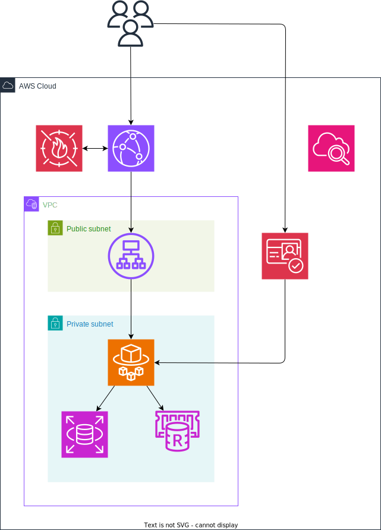

# 方式設計図

## 略語

|short|long|
|---|---|
|ALB|Application Load Balancer|
|WAF|Web Applcation Firewall|
|RDS|Relational Database Service|
|SSM|Systems MAnager|

## AWSアーキテクチャ

- User -> Cloud Front -> ALB -> ECS Fargate
    - Cloud Frontに紐付けたWAFで実IPベースのレート制限を行う
    - ALBでタスク増減時に適切なタスクに振り分ける
- ユーザ認証はCognitoを用いて行い、WebアプリケーションはCognitoからのログイン情報を元に認可を行う
- ECSタスク増加に対応できるよう、ストレージをそれぞれ下記で対応する
    - データベース: RDS
    - Redis: ElastiCache
- CloudWatchにWAF・Webアプリケーションのログを記録する

## タスク構成

- ALBから80/tcp(HTTP)でnginxコンテナにアクセス
- .phpの場合はnginxコンテナからappコンテナへ9000/tcpでアクセス
- appコンテナは必要に応じて下記にアクセス
    - 認証情報 -> Cognito
    - キャッシュ -> ElastiCache
    - データベース -> RDS

## デプロイ図

## mainブランチへのPull Request時

1. Dockerイメージのビルド
1. ECRへDockerイメージをアップロード
1. staging環境のECSを更新
    - ECRからDockerイメージを再読込
    - SSMからパラメタを再取得
1. staging環境にE2Eテストを実施
1. E2Eテストにパスした場合はマージ可能に

## mainブランチからProd環境へのデプロイ

1. Prod環境のECSタスクを更新
    - E2EテストをパスしたDockerイメージを再読込
    - SSMからパラメタを再取得
